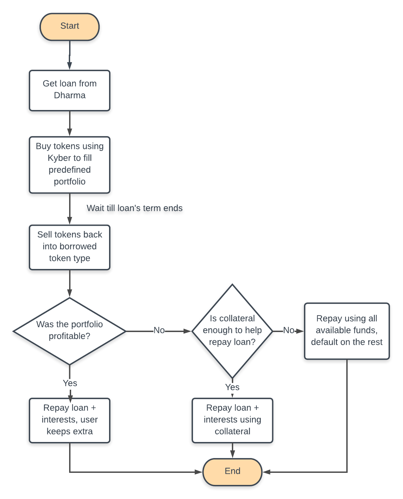

# Planck -- Supercharged Shorting Tool
Deployed on Kovan and testing is yet to be started.

**Planck** is a powerful decentralized financial instrument for **short-selling** Ether and ERC-20 tokens. It is powered by **Dharma Protocol** and **Kyber Network**.

- **Short ANY token**: Planck can be used to short Ether and any ERC-20 token supported by Kyber Network.

- **Sell into a custom portfolio**: Rather than short-selling into USD or DAI, Planck allows you to short-sell directly into a custom portfolio of Ether and ERC-20 tokens. **Short one asset & long others in one go!**

- **Creditor insurance**: All actions in Planck are handled through a smart contract, and the loaned money never touches the debtor (Planck's user) 's hands, so the loan's creditor can have minimal concern about the debtor defaulting.

- **Leverage**: Since the chance of the debtor defaulting is minimal, it is reasonable for creditors to offer loans requiring collateral less than the loan amount, giving Planck users **huge leveraging potential**.

- **Access to Dharma's network**: Planck has access to Dharma's open debt network to find creditors to pair up with Planck's users. This means Planck is quite future-proof.

## How does Planck work?

